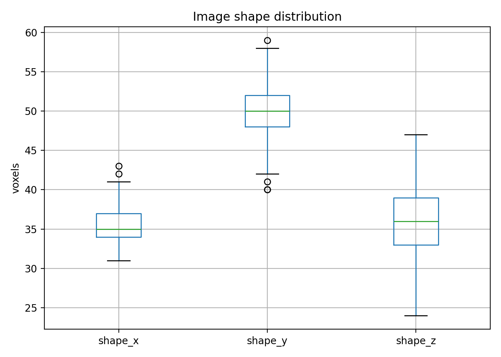
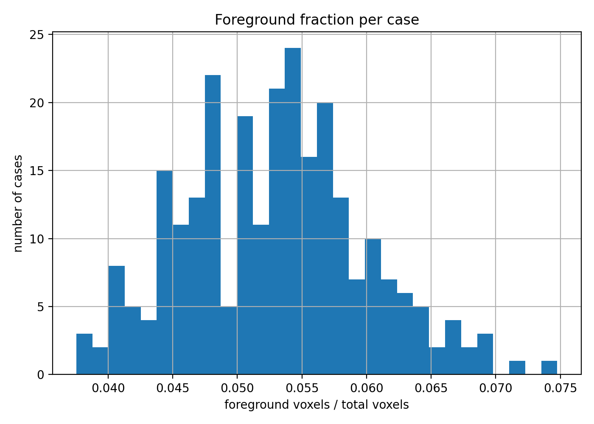

# 3D Hippocampus Segmentation with Monte Carlo Dropout Uncertainty Estimation

## Abstract

This project implements a 3D medical image segmentation pipeline for hippocampus segmentation using the Medical Segmentation Decathlon Task04 dataset. A 3D U-Net was trained with MONAI and PyTorch, evaluated using Dice score, Hausdorff distance, sensitivity, and specificity, and extended with Monte Carlo dropout to estimate predictive uncertainty. The main research question was whether uncertainty maps can highlight likely segmentation failure regions.

The baseline deterministic model achieved a mean foreground Dice score of **0.7160 ± 0.0504** on the internal test set. Monte Carlo dropout inference produced a slightly higher mean Dice score of **0.7228 ± 0.0489**. More importantly, uncertainty was higher in error regions: mean entropy on error voxels was **0.4517**, compared with mean foreground entropy of **0.2932**. Calibration analysis showed that all-voxel expected calibration error was low (**0.0104**), but foreground-only calibration error was much higher (**0.3525**), indicating that background-dominated calibration metrics can be misleading for segmentation tasks.

## 1. Introduction

Medical image segmentation models are often evaluated primarily by overlap metrics such as Dice score. However, in clinical settings, it is also important to know when a model is uncertain or likely to fail. A segmentation mask with no uncertainty information may appear authoritative even when the prediction is unreliable.

This project investigates uncertainty-aware 3D hippocampus segmentation. The goal is not only to train a segmentation model, but also to analyze whether uncertainty estimates correspond to segmentation errors. The guiding research question is:

> Can uncertainty estimates highlight likely segmentation failure regions in medical images?

The project uses a 3D U-Net baseline and Monte Carlo dropout uncertainty estimation. The uncertainty maps are evaluated visually and quantitatively by comparing uncertainty values against segmentation error regions.

## 2. Dataset and Data Exploration

### 2.1 Dataset

The experiment used the Medical Segmentation Decathlon Task04 Hippocampus dataset. The available labelled training data was split internally into training, validation, and test sets because the official test set does not include public labels.

The internal split used:

| Split | Fraction | Approximate number of cases |
|---|---:|---:|
| Training | 70% | 182 |
| Validation | 15% | 39 |
| Test | 15% | 39 |

### 2.2 Data characteristics

The dataset contained **260 labelled cases**. Every case contained the expected labels `[0, 1, 2]`, corresponding to background and two hippocampal substructures.

| Property | Result |
|---|---:|
| Number of labelled cases | 260 |
| Median shape | 35 × 50 × 36 voxels |
| Shape range, x | 31–43 voxels |
| Shape range, y | 40–59 voxels |
| Shape range, z | 24–47 voxels |
| Voxel spacing | 1.0 × 1.0 × 1.0 mm for all cases |
| Median foreground fraction | 0.0533 |
| Foreground fraction range | 0.0376–0.0748 |

The foreground occupied only about **5.33%** of voxels per case. This confirmed that the dataset has a strong foreground-background imbalance and justified foreground-biased patch sampling during training.





### 2.3 Visual inspection

Visual inspection of MRI images and segmentation labels was used to check whether labels were spatially plausible and aligned with the image content.


The overlays were treated as a necessary sanity check before training. Without this step, a model could be trained on incorrectly oriented or misaligned labels.

### 2.4 Preprocessing implications

The data exploration led to the following preprocessing decisions:

| Observation | Preprocessing decision |
|---|---|
| Small image volumes | Use small 3D patches rather than large 96³ patches |
| Uniform 1 mm isotropic spacing | Retain 1 mm resampling for consistency, not because correction was necessary |
| MRI intensities vary strongly between cases | Use per-case nonzero intensity normalization |
| Foreground is only about 5% of the volume | Use foreground-biased patch sampling |
| Labels are `[0, 1, 2]` in every case | Train a 3-class segmentation model |

The final training patch size was set to **32 × 32 × 32**. A larger patch size such as 96³ would be inappropriate for this dataset because the original volumes are much smaller than that in at least one dimension.

## 3. Methods

### 3.1 Preprocessing

The preprocessing pipeline used MONAI dictionary transforms:

1. Load image and label volumes.
2. Ensure channel-first format.
3. Reorient to a consistent anatomical orientation.
4. Resample to 1.0 × 1.0 × 1.0 mm spacing.
5. Normalize MRI intensities with nonzero, channel-wise normalization.
6. Crop around foreground.
7. Pad to the desired patch size.
8. Sample foreground-biased random patches.
9. Apply basic spatial and intensity augmentation.
10. Convert arrays to tensors.

The key preprocessing choice was:

```python
NormalizeIntensityd(keys=["image"], nonzero=True, channel_wise=True)
```

Fixed CT-style intensity windows were not used because the dataset consists of MRI volumes with inconsistent intensity scales across cases.

### 3.2 Model

The segmentation model was a 3D U-Net with:

| Setting | Value |
|---|---:|
| Input channels | 1 |
| Output classes | 3 |
| Spatial dimensions | 3D |
| Dropout | 0.1 |
| Loss | Dice + cross-entropy |
| Optimizer | AdamW |

Dropout was retained so that Monte Carlo dropout could be used during inference for uncertainty estimation.

### 3.3 Training

The model was trained for 100 epochs. Validation Dice was computed periodically using sliding-window inference.

Training loss decreased from **2.0226** at epoch 1 to **0.3077** at epoch 100. The best validation Dice was **0.6996** at epoch **96**.

| Quantity | Value |
|---|---:|
| Number of epochs | 100 |
| Initial training loss | 2.0226 |
| Final training loss | 0.3077 |
| Best validation Dice | 0.6996 |
| Best validation epoch | 96 |

### 3.4 Inference

Evaluation used sliding-window inference rather than whole-volume inference. This makes the pipeline compatible with larger 3D images and avoids GPU memory issues. The inference region of interest was set to **64 × 64 × 64**.

### 3.5 Uncertainty estimation

Uncertainty was estimated with Monte Carlo dropout. During inference, dropout layers were kept active and the model was run multiple times for each image. The final probability map was computed by averaging the Monte Carlo predictions.

This project used **20 Monte Carlo samples**.

The uncertainty measures were:

- **Predictive entropy**: high when class probabilities are diffuse.
- **Predictive variance**: high when Monte Carlo predictions disagree.

For each case, uncertainty was compared against segmentation error voxels, where the predicted label differed from the ground truth label.

### 3.6 Evaluation metrics

Segmentation quality was evaluated using:

- Dice score
- 95th percentile Hausdorff distance, or HD95
- Sensitivity
- Specificity

Metrics were computed separately for class 1 and class 2, then averaged across foreground classes. Specificity was interpreted cautiously because the large number of background voxels can make specificity appear high even when foreground segmentation is imperfect.

Calibration was evaluated using reliability diagrams and expected calibration error, both over all voxels and over foreground voxels only.

## 4. Results

### 4.1 Baseline deterministic segmentation

The deterministic 3D U-Net achieved a mean foreground Dice score of **0.7160 ± 0.0504** on the test set.

| Metric | Mean ± SD |
|---|---:|
| Dice, class 1 | 0.6847 ± 0.0755 |
| Dice, class 2 | 0.7473 ± 0.0521 |
| Mean foreground Dice | 0.7160 ± 0.0504 |
| HD95, class 1 | 13.7944 ± 9.0652 |
| HD95, class 2 | 6.3749 ± 6.3746 |
| Mean HD95 | 10.0846 ± 6.3994 |
| Mean sensitivity | 0.8047 ± 0.0474 |
| Mean specificity | 0.9939 ± 0.0015 |

Class 2 achieved higher Dice than class 1. Class 1 also had a higher HD95, suggesting that it was more difficult for the model to localize accurately.

Specificity was high, but this is expected in a dataset where most voxels are background. Therefore, Dice, HD95, and sensitivity are more informative than specificity for assessing foreground segmentation quality.

### 4.2 Monte Carlo dropout segmentation

Monte Carlo dropout inference achieved a mean foreground Dice score of **0.7228 ± 0.0489**.

| Metric | Deterministic | MC dropout |
|---|---:|---:|
| Mean foreground Dice | 0.7160 | 0.7228 |
| Mean HD95 | 10.0846 | 8.9888 |
| Mean sensitivity | 0.8047 | 0.7800 |
| Mean specificity | 0.9939 | 0.9949 |

MC dropout improved mean Dice by **0.0068** and reduced mean HD95 by **1.0958** voxels. Dice improved in **31 of 39** test cases.

The improvement in segmentation accuracy was modest. The more important contribution of MC dropout was the production of spatial uncertainty maps.

### 4.3 Uncertainty-error relationship

Uncertainty was higher in regions where the prediction disagreed with the ground truth.

| Quantity | Mean ± SD |
|---|---:|
| Mean entropy over all voxels | 0.0279 ± 0.0032 |
| Mean entropy over foreground | 0.2932 ± 0.0282 |
| Mean entropy over error voxels | 0.4517 ± 0.0416 |
| Mean variance over all voxels | 0.0017 ± 0.0003 |
| Mean variance over foreground | 0.0224 ± 0.0038 |
| Mean variance over error voxels | 0.0365 ± 0.0057 |

Mean entropy on error voxels was approximately **1.54×** higher than mean foreground entropy. Mean variance on error voxels was approximately **1.63×** higher than mean foreground variance.

This supports the project hypothesis: uncertainty estimates can help identify likely segmentation failure regions.


The qualitative examples show that uncertainty is concentrated around object boundaries, class transition regions, and areas where the prediction differs from the ground truth. This pattern is desirable because boundary regions are often the most ambiguous parts of a medical segmentation task.

### 4.4 Calibration

Calibration analysis produced very different results depending on whether all voxels or only foreground voxels were considered.

| Calibration metric | Value |
|---|---:|
| ECE, all voxels | 0.0104 |
| ECE, foreground voxels | 0.3525 |


The all-voxel ECE was low, but this result is misleading because most voxels are easy background voxels. The foreground-only ECE was much higher and is more relevant for segmentation quality.

The foreground reliability diagram shows that the model is overconfident in foreground regions. Many points lie below the diagonal, meaning the model's confidence is higher than its empirical accuracy. This suggests that raw softmax probabilities should not be interpreted as calibrated probabilities in the clinically relevant foreground region.

## 5. Discussion

The results show that a standard 3D U-Net can learn a reasonable hippocampus segmentation model on the MSD Task04 dataset. The achieved mean Dice score of **0.7160** is sufficient for a baseline research project, but it is not strong enough to claim clinical readiness.

The most important finding is that MC dropout uncertainty correlates with segmentation error. Entropy and variance were both higher on error voxels than in the foreground overall. This suggests that uncertainty maps can provide useful diagnostic information beyond the segmentation mask itself.

However, uncertainty should not be interpreted as a complete safety solution. The model can still be confidently wrong, especially in foreground regions where calibration was poor. The high foreground ECE indicates that better calibration methods or uncertainty estimation methods may be needed before such a system could be used in high-stakes settings.

The calibration results also demonstrate a common pitfall in medical segmentation evaluation: all-voxel metrics can be dominated by background. The all-voxel ECE suggested good calibration, but the foreground-only ECE revealed substantial overconfidence. For small-structure segmentation tasks, foreground-specific metrics are essential.

## 6. Limitations

This project has several limitations:

1. **Single dataset**: Only the MSD hippocampus task was used, so the results may not generalize to other organs, modalities, or scanners.
2. **Single architecture**: The experiment used a 3D U-Net baseline. More advanced models such as Attention U-Net, UNETR, or Swin UNETR were not tested.
3. **Limited uncertainty methods**: Only Monte Carlo dropout was evaluated. Deep ensembles or test-time augmentation may provide different uncertainty behavior.
4. **No external validation**: The model was evaluated on an internal split from the available labelled data.
5. **Foreground calibration remains poor**: The foreground ECE indicates that the model is overconfident in clinically relevant regions.
6. **Specificity is weakly informative**: Background dominance makes specificity appear high even when foreground segmentation quality is imperfect.
7. **No clinical expert review**: Visual quality was assessed qualitatively, but not by a radiologist or domain expert.

## 7. Conclusion

This project implemented a 3D hippocampus segmentation pipeline with uncertainty estimation using MONAI and PyTorch. The baseline 3D U-Net achieved moderate test performance, with a mean foreground Dice score of **0.7160**. Monte Carlo dropout provided a small improvement in segmentation accuracy and, more importantly, produced uncertainty maps that were higher in segmentation error regions.

The key conclusion is that MC dropout uncertainty can help identify likely failure regions in hippocampus segmentation, especially around boundaries and ambiguous foreground areas. However, the model remains overconfident in foreground regions, and all-voxel calibration metrics can hide this problem. Future work should evaluate stronger uncertainty methods, foreground-aware calibration, low-data robustness, and external validation.


